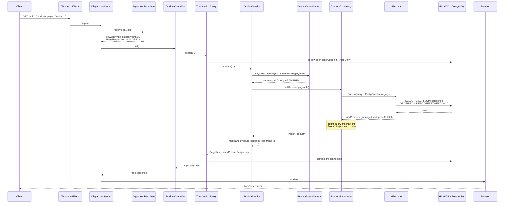

# Luồng hoạt động của hệ thống

Tài liệu này mô tả chi tiết điều gì xảy ra bên trong ứng dụng khi một HTTP request đi vào,
lấy ví dụ cụ thể:

```
GET http://localhost:8080/api/v1/products?page=0&size=10
```

Tham chiếu nhanh kiến trúc: **HTTP → DispatcherServlet → Controller → Service (transaction) → Repository → Hibernate → JDBC/HikariCP → PostgreSQL** rồi đi ngược lại.

---

## 0. Trước khi có request — giai đoạn khởi động

Chạy `CrudApiApplication.main()` (`src/main/java/com/example/crudapi/CrudApiApplication.java:10`), Spring Boot lần lượt:

1. **Tạo ApplicationContext** và quét component từ package gốc `com.example.crudapi`
   (nhờ `@SpringBootApplication`): tìm thấy `@RestController`, `@Service`, `@Configuration`,
   `@RestControllerAdvice`. Các interface `@Repository` được Spring Data JPA sinh proxy
   implementation lúc runtime (ta không viết class cài đặt nào).
2. **Khởi tạo HikariCP** theo `application.yml`: tối đa 10 connection, timeout 30s.
3. **Chạy Flyway** (`spring.flyway.enabled: true`) với các file trong
   `src/main/resources/db/migration`: `V1` tạo bảng `products`, `V2` seed 3 product,
   `V3` tạo bảng `categories` + cột `products.category_id` + FK + index, `V4` seed category.
   Flyway ghi lại lịch sử vào bảng `flyway_schema_history` nên lần chạy sau không lặp lại.
4. **Khởi tạo Hibernate** với `ddl-auto: validate` — Hibernate **không** sinh DDL, chỉ đối chiếu
   entity (`Product`, `Category`) với bảng thật. Thiếu cột hay sai kiểu là app fail ngay lúc start.
   Thứ tự Flyway chạy trước Hibernate validate là bắt buộc, và Spring Boot đã lo sẵn.
5. **Đăng ký `DispatcherServlet`** và build bảng ánh xạ URL → method:
   `RequestMappingHandlerMapping` đọc `@RequestMapping("/api/v1/products")` + `@GetMapping`
   của `ProductController` để biết `GET /api/v1/products` phải gọi `ProductController.list(...)`.
6. **Bọc proxy transaction**: `ProductService` có `@Transactional` nên Spring tạo một proxy
   bọc quanh bean thật. Bean mà `ProductController` nhận được chính là proxy này — đây là lý do
   ranh giới transaction nằm ở Service chứ không phải Controller.
7. **Khởi động Tomcat nhúng** ở cổng 8080 và bắt đầu nhận kết nối.

---

## 1. Tomcat nhận kết nối

Tomcat lấy một thread từ worker pool để xử lý request (mỗi request một thread, mô hình servlet
blocking truyền thống). Request đi qua filter chain (`CharacterEncodingFilter`,
`FormContentFilter`, `RequestContextFilter`, ...) rồi tới `DispatcherServlet`.

> Dự án chưa có Spring Security nên không có security filter chain.

---

## 2. DispatcherServlet định tuyến

`DispatcherServlet` hỏi `RequestMappingHandlerMapping`: "ai xử lý `GET /api/v1/products`?"
→ trả về `ProductController.list(String keyword, Long categoryId, Pageable pageable)`
(`src/main/java/com/example/crudapi/web/ProductController.java:40`).

---

## 3. Giải mã tham số (argument resolver)

Trước khi gọi method, Spring phải dựng 3 tham số:

| Tham số | Resolver | Kết quả với `?page=0&size=10` |
|---|---|---|
| `keyword` | `RequestParamMethodArgumentResolver` | `null` (`required = false`, không gửi) |
| `categoryId` | `RequestParamMethodArgumentResolver` | `null` |
| `pageable` | `PageableHandlerMethodArgumentResolver` | `PageRequest.of(0, 10, Sort.by(DESC, "id"))` |

Chi tiết về `Pageable` — đây là phần dễ nhầm nhất:

- `page=0` và `size=10` lấy từ query string.
- `sort` **không** được gửi, nên `@PageableDefault(size = 20, sort = "id", direction = DESC)`
  điền vào phần còn lại → sắp xếp `id DESC`.
- `size = 20` trong `@PageableDefault` bị `size=10` của client ghi đè. Giá trị mặc định chỉ
  áp dụng cho thuộc tính client không gửi.
- Spring Data chặn trần `size` ở 2000 (`max-page-size` mặc định), gửi `size=100000` sẽ bị hạ xuống.

Nếu client gửi `categoryId=abc` thì resolver không ép được sang `Long` và ném
`MethodArgumentTypeMismatchException` — xem mục [Luồng lỗi](#luồng-lỗi).

---

## 4. Controller gọi Service

```java
return productService.search(keyword, categoryId, pageable);
```

Controller **không chứa business logic** — chỉ nhận HTTP và uỷ quyền. Lưu ý lời gọi này thực
chất đi vào **proxy transaction** đã nói ở bước 0.6.

---

## 5. Mở transaction

`ProductService` khai báo `@Transactional(readOnly = true)` ở cấp class
(`src/main/java/com/example/crudapi/service/ProductService.java:25`), method `search` không
override nên kế thừa. Proxy thực hiện:

1. Mượn một connection từ HikariCP.
2. Đặt connection ở chế độ read-only (gợi ý cho driver/DB).
3. Mở `EntityManager` (persistence context) và gắn vào thread hiện tại.
4. Đặt `FlushMode = MANUAL` — không dirty-checking, không flush. Đây là lý do `readOnly = true`
   nhẹ hơn transaction ghi: Hibernate không cần giữ snapshot để so sánh thay đổi.

---

## 6. Dựng điều kiện lọc bằng Specification

```java
Specification<Product> spec = ProductSpecifications.keywordMatches(keyword)
        .and(ProductSpecifications.hasCategory(categoryId));
```

Cả `keyword` và `categoryId` đều `null`, nên cả hai method trả về `Specification.unrestricted()`
— một điều kiện **luôn đúng**, không sinh ra mệnh đề `WHERE` nào.

Đây là điểm thiết kế đáng chú ý: bộ lọc vắng mặt trở thành "luôn đúng" thay vì `null`, nên
service không phải phân nhánh `if` theo từng tổ hợp. Hai bộ lọc tuỳ chọn = 4 tổ hợp; thêm
một bộ lọc nữa thành 8. Với `Specification`, số nhánh không tăng.

---

## 7. Repository truy vấn DB

```java
Page<Product> page = productRepository.findAll(spec, pageable);
```

`ProductRepository` kế thừa `JpaSpecificationExecutor<Product>`, và override `findAll` chỉ để gắn
`@EntityGraph(attributePaths = "category")`
(`src/main/java/com/example/crudapi/repository/ProductRepository.java:35`).

Bên trong, `SimpleJpaRepository` làm các việc sau:

### 7.1. Dựng Criteria query

Spring Data tạo `CriteriaQuery<Product>`, áp `Specification` (ở đây rỗng), áp `Sort` thành
`ORDER BY`, và áp entity graph thành một `LEFT JOIN FETCH` tới `categories`.

### 7.2. Chạy câu query lấy dữ liệu

Hibernate dịch sang SQL (profile `dev` sẽ in ra console):

```sql
select p1_0.id, p1_0.created_at, p1_0.description, p1_0.name, p1_0.price,
       p1_0.quantity, p1_0.sku, p1_0.updated_at, p1_0.version,
       c1_0.id, c1_0.created_at, c1_0.description, c1_0.name, c1_0.updated_at, c1_0.version
from products p1_0
left join categories c1_0 on c1_0.id = p1_0.category_id
order by p1_0.id desc
offset ? rows fetch first ? rows only
```

Bind: `offset = 0`, `fetch first = 10` (PostgreSQL dialect của Hibernate 6 dùng cú pháp chuẩn
SQL, tương đương `LIMIT 10 OFFSET 0`).

Ba điểm quan trọng:

- **`LEFT JOIN` chứ không phải `INNER JOIN`**: `products.category_id` nullable, product chưa phân
  loại vẫn phải xuất hiện trong kết quả.
- **`@EntityGraph` dập tắt N+1**: `Product.category` khai báo `FetchType.LAZY`. Không có entity
  graph, Hibernate trả về 10 product rồi bắn thêm tối đa 10 câu `SELECT ... FROM categories`
  khi DTO đọc `getCategory()` — kinh điển N+1. `@EntityGraph` gộp tất cả vào một câu query.
- **Vẫn phân trang được ở tầng SQL**: vì join tới `@ManyToOne` (quan hệ một-một về phía product)
  nên số dòng trả về không nở ra, `OFFSET/FETCH` áp dụng đúng. Nếu sau này fetch một
  `@OneToMany`, Hibernate buộc phải phân trang **trong bộ nhớ** và cảnh báo `HHH90003004`.

### 7.3. Chạy câu count — có điều kiện

Spring Data dùng `PageableExecutionUtils.getPage(content, pageable, countSupplier)`. Count query
chỉ chạy **khi cần**:

- Đang ở trang đầu (`offset == 0`) và số bản ghi trả về **nhỏ hơn** `size`
  → đã chắc chắn đây là toàn bộ dữ liệu, `totalElements = content.size()`, **bỏ qua count**.
- Ngược lại mới chạy:

```sql
select count(p1_0.id) from products p1_0
```

Với dữ liệu seed hiện tại (3 product, `size=10`), **count query bị bỏ qua** và chỉ có đúng
**1 câu SQL** chạm DB. Nếu bảng có 100 product thì sẽ có 2 câu SQL.

> Mẹo quan sát: chạy `./mvnw spring-boot:run -Dspring-boot.run.profiles=dev` để bật
> `show-sql` và log bind parameter.

### 7.4. Hibernate nạp kết quả vào persistence context

Mỗi dòng SQL được dựng thành một `Product` managed, kèm `Category` đã fetch sẵn.
Spring Data gói lại thành `PageImpl<Product>`.

---

## 8. Map entity → DTO (vẫn trong transaction)

```java
return PageResponse.of(page, ProductResponse::from);
```

`ProductResponse.from()` đọc `product.getCategory()`. Việc này xảy ra **trong** transaction và
category **đã được fetch** ở bước 7.2, nên an toàn. Điều này quan trọng vì
`spring.jpa.open-in-view: false` — persistence context đóng ngay khi service return, truy cập
lazy field sau đó sẽ ném `LazyInitializationException`.

`CategorySummary.from()` trả về `null` nếu product chưa có category — không NPE.

Entity **không bao giờ** rò ra ngoài tầng service: `PageResponse<ProductResponse>` là record thuần
Java, không còn dính Hibernate proxy.

Ta cũng không trả thẳng `Page<T>` của Spring Data ra API vì cấu trúc JSON của nó không ổn định
giữa các phiên bản; `PageResponse` khoá cứng hợp đồng API lại.

---

## 9. Đóng transaction

Service return → proxy commit transaction (read-only, không có gì để flush) → đóng
`EntityManager` → **trả connection về HikariCP**. Từ đây trở đi không còn kết nối DB nào.

---

## 10. Serialize JSON và trả response

`DispatcherServlet` thấy method có `@ResponseBody` (ngầm định qua `@RestController`), chọn
`MappingJackson2HttpMessageConverter` dựa trên `Accept` header, và Jackson serialize
`PageResponse` thành JSON.

`spring.jackson.default-property-inclusion: non_null` khiến **field null bị loại khỏi output** —
nên product không có `description` hoặc `category` sẽ đơn giản là thiếu key đó.

```
HTTP/1.1 200 OK
Content-Type: application/json
```

```json
{
  "content": [
    {
      "id": 3,
      "sku": "SKU-003",
      "name": "Man hinh 27 inch",
      "description": "Do phan giai 2K, 144Hz",
      "price": 6490000.00,
      "quantity": 7,
      "category": { "id": 2, "name": "Man hinh" },
      "createdAt": "2026-10-07T03:21:44.512Z",
      "updatedAt": "2026-10-07T03:21:44.512Z"
    }
  ],
  "page": 0,
  "size": 10,
  "totalElements": 3,
  "totalPages": 1,
  "last": true
}
```

Thread Tomcat được trả về pool.

---

## Sơ đồ tuần tự



---

## Luồng ghi khác gì luồng đọc

### `POST /api/v1/products`

1. Jackson deserialize body → `ProductRequest` (record).
2. `@Valid` kích hoạt Bean Validation **trước khi** vào controller body. Sai ràng buộc →
   `MethodArgumentNotValidException` → 400 kèm map `errors` từng field, service không hề được gọi.
3. `@Transactional` (không `readOnly`) mở transaction ghi.
4. `existsBySku(sku)` → `SELECT COUNT(*)`; trùng → `DuplicateResourceException` → 409.
5. `resolveCategory(categoryId)` dùng `findById` chứ không phải `getReferenceById`:
   `getReferenceById` chỉ trả proxy, categoryId sai sẽ lộ ra thành lỗi FK lúc flush (500 khó hiểu).
   `findById` cho phép báo 404 rõ ràng, đổi lại một câu `SELECT`.
6. `save()` → Hibernate `INSERT`. `@CreatedDate`/`@LastModifiedDate` được
   `AuditingEntityListener` điền tự động (bật bởi `JpaAuditingConfig`), `version` khởi tạo = 0.
7. Commit. Controller dựng header `Location` và trả **201 Created**.

### `PUT /api/v1/products/{id}`

Điểm đáng chú ý: sau khi sửa entity, service **không gọi `save()`**. Entity đang ở trạng thái
*managed* trong persistence context, Hibernate tự dirty-check và flush `UPDATE` lúc commit.
`@Version` tăng lên; nếu hai request cùng sửa một bản ghi, request đến sau nhận
`OptimisticLockingFailureException` → 409 thay vì âm thầm ghi đè (lost update).

### `DELETE /api/v1/products/{id}`

`findOrThrow` → không có thì 404; có thì `DELETE`, trả **204 No Content**.

### Phía `CategoryController`

Xoá category đang được product tham chiếu sẽ bị chặn bằng `existsByCategoryId` →
`ResourceInUseException` → 409, thay vì để FK constraint ném lỗi 500. Index
`idx_products_category_id` (tạo ở `V3`) tồn tại chính để việc kiểm tra này không phải seq scan
toàn bảng `products` — PostgreSQL **không** tự tạo index cho cột FK.

---

## Luồng lỗi

Mọi exception thoát khỏi controller đều rơi vào `GlobalExceptionHandler`
(`@RestControllerAdvice`) và được chuyển thành `ProblemDetail` theo RFC 7807.
Nhờ đó controller/service không phải tự dựng `ResponseEntity` lỗi.

| Tình huống | Exception | HTTP |
|---|---|---|
| `?sort=khongtontai` | `PropertyReferenceException` | 400 |
| `?categoryId=abc` | `MethodArgumentTypeMismatchException` | 400 |
| Body sai ràng buộc | `MethodArgumentNotValidException` | 400 (kèm `errors` theo field) |
| Không tìm thấy id | `ResourceNotFoundException` | 404 |
| SKU / tên category trùng | `DuplicateResourceException` | 409 |
| Xoá category đang dùng | `ResourceInUseException` | 409 |
| Hai request cùng sửa 1 bản ghi | `OptimisticLockingFailureException` | 409 |
| Vi phạm ràng buộc DB (race condition) | `DataIntegrityViolationException` | 409 |
| Còn lại | `Exception` | 500 (log stacktrace, không lộ ra client) |

Lưu ý `?categoryId=999` (không tồn tại) **không** phải lỗi — nó là **bộ lọc**, không phải truy
xuất resource, nên trả về trang rỗng `200` chứ không phải 404.

`server.error.include-message: never` và `include-stacktrace: never` đảm bảo chi tiết nội bộ
không rò ra ngoài qua trang lỗi mặc định của Spring Boot.

---

## Bảng tổng kết: file nào làm gì trong luồng này

| Thứ tự | File | Vai trò |
|---|---|---|
| 1 | `web/ProductController.java` | Nhận HTTP, khai báo default phân trang, uỷ quyền |
| 2 | `service/ProductService.java` | Business logic, **ranh giới transaction**, map DTO |
| 3 | `repository/ProductSpecifications.java` | Dựng điều kiện lọc ghép được |
| 4 | `repository/ProductRepository.java` | Khai báo query, gắn `@EntityGraph` chống N+1 |
| 5 | `entity/Product.java`, `entity/Category.java` | Ánh xạ bảng, auditing, `@Version` |
| 6 | `dto/ProductResponse.java`, `dto/CategorySummary.java`, `dto/PageResponse.java` | Hợp đồng JSON ra |
| 7 | `exception/GlobalExceptionHandler.java` | Chuyển exception → ProblemDetail |
| — | `config/JpaAuditingConfig.java` | Bật `@CreatedDate` / `@LastModifiedDate` |
| — | `resources/db/migration/*.sql` | Flyway làm chủ schema; Hibernate chỉ validate |

---

## Cách tự kiểm chứng

```bash
# Bật log SQL + bind parameter
./mvnw spring-boot:run -Dspring-boot.run.profiles=dev

# Gọi thử và quan sát console
curl "http://localhost:8080/api/v1/products?page=0&size=10"

# Thử các biến thể để thấy SQL thay đổi
curl "http://localhost:8080/api/v1/products?keyword=ban&size=2"        # sinh ra WHERE ... LIKE
curl "http://localhost:8080/api/v1/products?categoryId=1"              # lọc theo category_id
curl "http://localhost:8080/api/v1/products?page=1&size=2"             # offset > 0 → có count query
curl "http://localhost:8080/api/v1/products?sort=khongtontai"          # 400 ProblemDetail
```

Swagger UI: <http://localhost:8080/swagger-ui.html>
